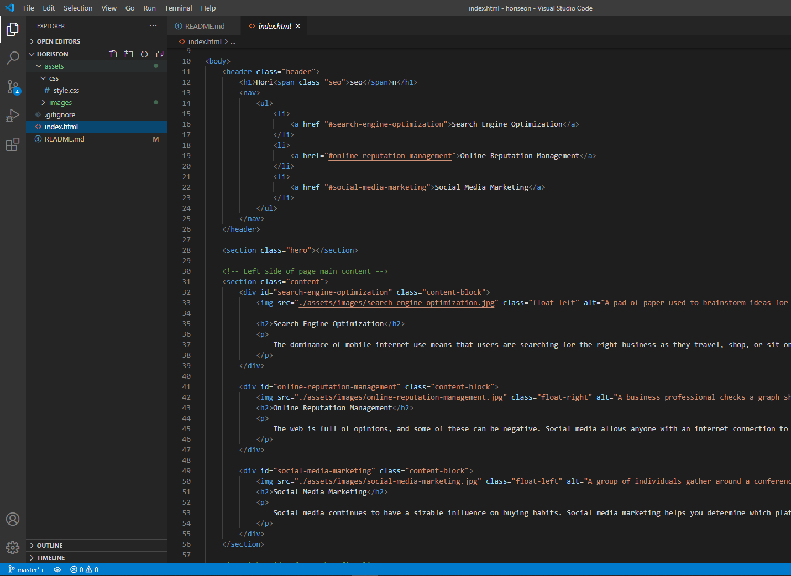
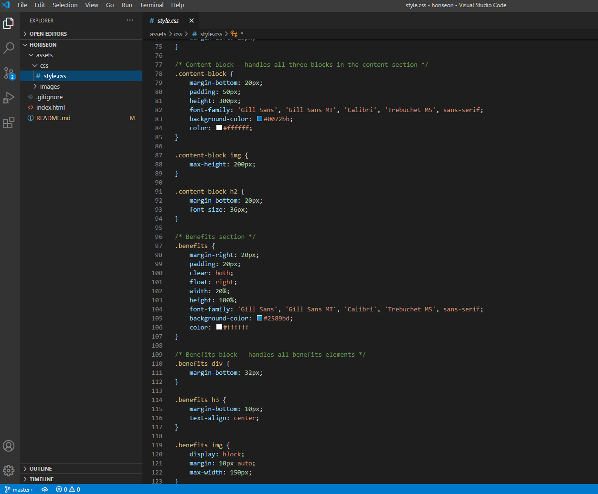
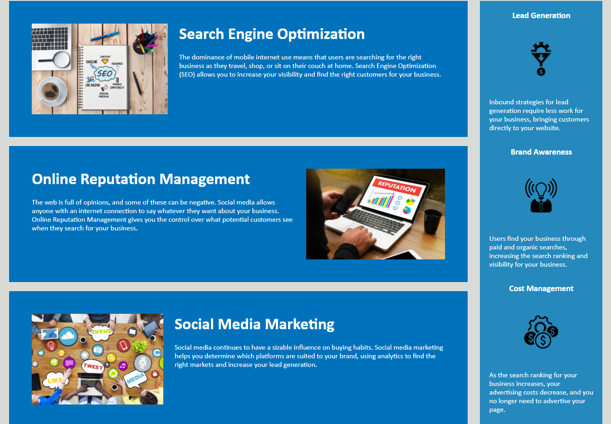

# Horiseon Website

## Description

This is my edit on the existing horiseon main page. I started by cleaning up much of the existing HTML, making it easier to navigate and understand
for someone coming in fresh to the website. Cleaned up broken links and added alt tags to all of the relavent images across the website to meet 
modern standards of accessability and SEO.

Once the HTML had a better natural flow, began working on CSS. Initial CSS was all functional but difficult to read for new developers with no notes.
Took all of the existing code and re-arranged everything so it had a better flow. Found code that could easily be consolidated down especially in the
content section and benefits sections.

## Website

The live website can be found at https://uberbrent.github.io/horiseon/

## Screenshots
Example of the updated HTML for easier reading:

Example of the CSS consolidation with notes:

The completed website:

